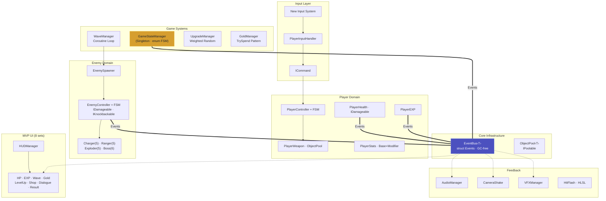

# Dungeon Survivors

2D 탑다운 로그라이크 슈터. 웨이브 기반 던전에서 패시브 업그레이드와 무기를 강화해서 몬스터 군단을 해치우는 게임입니다. FSM, EventBus, MVP, 오브젝트 풀링 등의 디자인 패턴을 중심으로 설계했습니다.

> **포트폴리오 프로젝트** — 1인 개발, 3주 완성


---

## Tech Stack

| Category | Detail |
|----------|--------|
| **Engine** | Unity 2022.3 LTS (2D URP) |
| **Language** | C# |
| **Packages** | New Input System, Cinemachine 2.9.7, TextMeshPro |
| **Art** | 0x72 DungeonTileset II (itch.io, 16×16 pixel art) |
| **Version Control** | Git + GitHub (Conventional Commits) |

---

## Core Features

### 🎮 Player System
- **IState 기반 FSM** — Idle, Move, Attack, Dash 4개 상태. 글로벌 전환(Dash 최우선, Attack)과 상태 내부 전환 분리
- **Command Pattern 입력** — New Input System + ICommand 인터페이스. MoveCommand, LookCommand로 입력과 실행을 분리
- **Base + Modifier 스탯** — PlayerStats가 업그레이드를 Dictionary로 누적 관리. 순서 무관 계산

### 👾 Enemy AI (4종 + Boss)
- **Charger** — 5-state FSM (Idle → Chase → Charge → Stunned → Dead)
- **Ranger** — 5-state FSM. 히스테리시스 버퍼로 경계 진동 방지. 거리 기반 Reposition
- **Exploder** — 5-state FSM. WindUp 범위 인디케이터 + AoE 자폭. Physics2D.OverlapCircleAll
- **Boss** — 3-Phase 6-state FSM (Chase → Charge/Ranged/Summon → Recovery/Dead). Phase별 행동 라우팅(Priority-based Action Selection). Phase 3 Enrage: 3-way spread shot + 속도/쿨다운 배율 적용
- 모든 적은 **EnemyData(abstract) SO 상속 구조** — ChargerData, RangerData, ExploderData, BossData

### ⚙️ Core Systems
- **EventBus\<T\>** — 타입 기반 static 제네릭. struct 이벤트(GC-free). 10종 이벤트로 시스템 간 완전 디커플링
- **ObjectPool\<T\>** — 커스텀 제네릭 풀 + IPoolable 인터페이스. Projectile, EXPOrb, DeathVFX에 적용
- **ScriptableObject Data Pipeline** — WeaponData, EnemyData(상속), UpgradeData, DialogueData, AudioData. 데이터/로직 분리
- **GameStateManager** — enum 기반 상태 머신(Singleton). Title/Playing/Paused/LevelUp/Shop/GameOver/Victory. Time.timeScale 중앙 제어

### 🖥️ MVP UI Framework (8종)
- HP Bar, EXP Bar, Wave Counter, Gold Display, LevelUp Selection, Shop, Dialogue, Result Screen
- **Model**(Pure C#) / **View**(MonoBehaviour, IView 인터페이스) / **Presenter**(EventBus 구독 Mediator) 3계층 분리
- **DTO 패턴** — UpgradeCardData, ShopWeaponCardData, ResultData struct로 View를 SO에서 디커플링 (DIP)
- Presenter는 항상 활성 오브젝트에 배치 — SetActive(false)로 인한 EventBus 구독 해제 방지 (트러블슈팅 #11에서 학습)

### 🏪 NPC & Dialogue
- **IInteractable 인터페이스** — PlayerInteraction이 OverlapCircle로 감지, E키 상호작용
- **DialogueData SO + DialogueManager** — C# event 통신(같은 도메인 1:1). actionKey 문자열로 구체 시스템과 디커플링(OCP)
- **ShopNPC** — 웨이브 간 자동 활성화. 무기 교체 + 강화. Fisher-Yates 랜덤 선택. TrySpend 패턴

### ✨ Feedback & Polish
- **HitFlash** — 커스텀 HLSL 셰이더 + MaterialPropertyBlock(배칭 보존). Update 타이머 페이드아웃(GC 0)
- **Camera Shake** — Cinemachine Impulse + EventBus 디커플링. 이벤트별 강도 차등
- **Death VFX** — ObjectPool\<DeathVFX\> 풀링 기반 파티클
- **Audio** — AudioManager Singleton. BGM(루프) + SFX(PlayOneShot 중첩). EventBus + 직접 호출 하이브리드

### 🔄 Game Flow
- **Title Scene** → Start → **Game Scene** (Wave 1~10) → **Victory/GameOver** → Restart/Title
- **Result Screen** — RunStatsTracker가 EventBus로 런 통계 수집(킬, 골드, 웨이브, 레벨, 생존시간). Victory/GameOver가 동일 View 공유(OCP)

---

## Architecture

### System Overview



### Applied Design Patterns

| Pattern | Where Applied |
|---------|--------------|
| **FSM (IState)** | Player (4 states), Charger (5), Ranger (5), Exploder (5), Boss (6), GameStateManager (enum) |
| **Command** | PlayerInputHandler → MoveCommand, LookCommand |
| **Object Pooling** | Projectile, EXPOrb, DeathVFX |
| **Observer (EventBus)** | 10 event types, 17+ subscribers |
| **MVP** | 8 UI systems (Model / View / Presenter) |
| **ScriptableObject Data-Driven** | WeaponData, EnemyData hierarchy, UpgradeData, DialogueData, AudioData |
| **Singleton** | GameStateManager, AudioManager (minimal — 2 only) |
| **DTO** | UpgradeCardData, ShopWeaponCardData, ShopEnhanceData, ResultData |
| **Weighted Random** | UpgradeManager (Rarity-based cumulative weight) |
| **TryPattern** | GoldManager.TrySpend() |
| **Fisher-Yates Shuffle** | ShopModel inventory generation |
| **Hysteresis** | RangerAttackState (state oscillation prevention) |
| **Priority-based Selection** | BossChaseState (cooldown + phase routing) |
| **MaterialPropertyBlock** | HitFlash (batching-safe per-renderer override) |
| **FSM-driven Animation** | State.Enter() → Animator.Play() (FSM = Single Source of Truth) |

### SOLID Principles

- **SRP**: PlayerHealth / ContactDamage / SpriteFlip / HitFlash 각각 단일 책임. WaveManager(전략) / EnemySpawner(전술) 분리. RunStatsTracker 통계 집계 분리
- **OCP**: EventBus 구독으로 기존 코드 수정 없이 VFX/Audio/Stats 시스템 추가. DialogueData.actionKey string으로 확장. Victory/GameOver View 공유
- **ISP**: IKnockbackable을 IDamageable에서 분리 — 넉백이 필요 없는 오브젝트는 IDamageable만 구현
- **DIP**: Projectile → IDamageable (구체 타입 모름). Presenter → IView. PlayerInteraction → IInteractable

---

## Technical Highlights

### 1. EventBus — Type-based Static Generic

```csharp
// Publisher: zero coupling — only knows the event type
EventBus<EnemyDiedEvent>.Raise(new EnemyDiedEvent
{
    Position = transform.position,
    EXPReward = _data.EXPReward,
    GivesReward = !_isSummoned
});

// Subscriber: any system can listen without reference to publisher
EventBus<EnemyDiedEvent>.Subscribe(OnEnemyDied);
```

하나의 `EnemyDiedEvent`가 6개 시스템(EXPManager, GoldManager, WaveManager, VFXManager, CameraShakeManager, AudioManager, RunStatsTracker)에 동시 전파됩니다. 발행자와 구독자 사이에 직접 참조가 없어 시스템 추가/제거 시 기존 코드 수정이 0줄입니다.

C# event와의 차이: C# event는 발행자 인스턴스에 대한 참조가 필요하지만, EventBus는 이벤트 타입만 알면 되므로 도메인 간 통신에 적합합니다.

### 2. Boss 3-Phase FSM — Priority-based Action Selection

```csharp
// BossChaseState: Hub state that routes to actions
int phase = _bossData.GetPhase(controller.CurrentHP, controller.MaxHP);

if (phase >= 2 && _summonCooldownTimer <= 0f)
    controller.FSM.ChangeState(controller.SummonState);  // Highest priority
else if (_chargeCooldownTimer <= 0f && distToPlayer <= _bossData.ChargeRange)
    controller.FSM.ChangeState(controller.ChargeState);
else if (phase >= 2 && _rangedCooldownTimer <= 0f)
    controller.FSM.ChangeState(controller.RangedState);
```

BossData SO의 `GetPhase()` 순수 함수가 HP 비율로 현재 Phase를 반환합니다. Phase 3 Enrage는 별도 상태를 추가하지 않고 기존 상태 내에서 데이터 배율(속도 ×1.5, 3-way spread shot, 소환 쿨다운 30% 감소)만 변경합니다.

### 3. MVP — View는 "멍청하게", Presenter가 중재

```
[EventBus] → Presenter → Model → View (표시만)
                ↑                    |
                +--- Action callback -+  (사용자 입력)
```

View는 데이터를 받아 표시하기만 합니다(Slider, TMP 조작). 게임 로직은 Presenter가 담당하고, Model은 순수 C# 클래스(MonoBehaviour 아님)로 데이터만 보관합니다. View와 ScriptableObject 사이에 DTO struct를 두어 의존성을 역전시켰습니다.

### 4. Custom HLSL Hit Flash — MaterialPropertyBlock

```csharp
// HitFlash.cs — GC allocation: 0 per frame
private static readonly int FlashAmountID = Shader.PropertyToID("_FlashAmount");

public void Flash()
{
    _flashTimer = _flashDuration;  // Reset timer, no coroutine
}

private void Update()
{
    if (_flashTimer <= 0f) return;
    _flashTimer -= Time.deltaTime;
    float amount = _flashTimer / _flashDuration;
    _mpb.SetFloat(FlashAmountID, amount);
    _renderer.SetPropertyBlock(_mpb);
}
```

---

## Troubleshooting Cases

### Case 1: SetActive(false)가 EventBus 구독을 끊는 문제

**문제**: 레벨업 시 GameState가 LevelUp으로 전환되지만 레벨업 패널이 표시되지 않음

**원인 분석**: LevelUpPresenter가 LevelUpPanel(View)과 같은 GameObject에 있었음. 패널이 `SetActive(false)`로 숨겨지면 `OnDisable()` → `EventBus.Unsubscribe()` 호출 → 이후 `GameStateChangedEvent`를 수신하지 못함

**해결**: Presenter를 항상 활성인 별도 GameObject로 분리. View(패널)만 `SetActive`로 토글

**교훈**: Unity의 `SetActive(false)`는 해당 오브젝트의 모든 MonoBehaviour에 `OnDisable()`을 호출합니다. EventBus를 구독하는 컴포넌트는 반드시 비활성화되지 않는 오브젝트에 배치해야 합니다. 이 규칙은 이후 ShopPresenter, DialoguePresenter, ResultPresenter 모두에 일관 적용했습니다.

### Case 2: 보스 미니언이 웨이브 완료 조건을 조기 충족시키는 문제

**문제**: 보스 웨이브에서 소환된 Charger를 죽이면 보스가 살아있는데 다음 웨이브로 넘어감

**원인 분석**: WaveManager가 `_enemiesAlive` 카운터로 웨이브 완료를 판정. 보스 스폰 시 `_enemiesAlive = 1`. 미니언 사망 → `EnemyDiedEvent` 발행 → `_enemiesAlive--` → 0 → `WaitUntil` 완료 조건 충족. EventBus의 장점인 디커플링이 여기서는 "의도하지 않은 구독자 반응"이라는 양면성을 보여줌

**해결**: 보스 웨이브의 완료 조건을 카운터 기반에서 `bossObj == null` (GameObject 직접 참조)로 변경. `SpawnEnemyAndReturn()` API 추가

**교훈**: EventBus 디커플링은 강력하지만, 이벤트 발행 경로가 여러 개(일반 적 사망 + 미니언 사망)일 때 모든 경로가 동일 계약을 지키는지 검증해야 합니다. 보스 웨이브처럼 특수한 완료 조건이 필요한 경우, 범용 이벤트 카운터보다 직접 참조가 더 안전합니다.

### Case 3: FSM 상태 경계 진동으로 인한 Ranger 쿨다운 우회

**문제**: Ranger가 AttackRange 경계에서 비정상적으로 빠른 연사 (탄막 폭발)

**원인 분석**: 플레이어 미세 이동으로 Chase ↔ Attack 매 프레임 진동 발생. `Attack.Enter()` 진입 시마다 `_fireCooldownTimer = 0f`로 리셋 → 사실상 쿨다운 무시

**해결**: 두 가지 보완 적용
1. `_initialized` 플래그 — 최초 진입만 쿨다운 0, 재진입 시 잔여 쿨다운 보존
2. Chase 복귀 조건에 히스테리시스 버퍼 `AttackRange + 1f` 적용 — 진입/탈출 임계값을 다르게 설정

**교훈**: FSM에서 상태 전환 조건이 연속적 수치(거리, HP 등)에 기반할 때, 진입 조건과 탈출 조건에 반드시 히스테리시스 버퍼를 적용해야 합니다. 또한 `Enter()`에서 타이머를 리셋할 때 재진입 시나리오를 반드시 고려해야 합니다.

---

## Project Structure

```
_Project/Scripts/
├── Core/           GameStateManager, ObjectPool, Interfaces (IDamageable, IPoolable, IKnockbackable, IInteractable)
│   ├── FSM/        IState, StateMachine
│   └── Events/     IEvent, EventBus<T>, GameEvents (10 event types)
├── Input/          ICommand, MoveCommand, LookCommand, PlayerInputHandler
├── Player/         PlayerController, PlayerHealth, PlayerEXP, PlayerStats, PlayerMagnet, PlayerInteraction
│   └── States/     PlayerIdleState, PlayerMoveState, PlayerAttackState, PlayerDashState
├── Enemy/          EnemyController, EnemySpawner
│   └── States/     Charger(5), Ranger(5), Exploder(5), Boss(6)
├── Combat/         Projectile, PlayerWeapon, ContactDamage, EXPOrb, EXPManager, EnemyProjectile, DeathVFX
├── Data/           WeaponData, EnemyData(abstract), ChargerData, RangerData, ExploderData, BossData,
│                   UpgradeData, DialogueData, AudioData
├── Systems/        WaveManager, UpgradeManager, GoldManager, CameraShakeManager, VFXManager,
│                   AudioManager, RunStatsTracker
├── NPC/            DialogueManager, ShopNPC
├── UI/
│   ├── Interfaces/ IView, IHPBarView, IEXPBarView, IWaveView, ILevelUpView, IGoldView,
│   │               IDialogueView, IShopView, IResultView
│   ├── Models/     HPBarModel, EXPBarModel, WaveModel, LevelUpModel, GoldModel, ShopModel
│   ├── Views/      HPBarView, EXPBarView, WaveView, LevelUpView, GoldView, DialogueView,
│   │               ShopView, ResultView, UpgradeCardUI, ShopWeaponCardUI
│   ├── Presenters/ HPBarPresenter, EXPBarPresenter, WavePresenter, LevelUpPresenter,
│   │               GoldPresenter, DialoguePresenter, ShopPresenter, ResultPresenter
│   └── HUDManager, TitleScreenUI
├── Utils/          InputSystemInitializer, SpriteFlip, HitFlash
└── Shaders/        SpriteFlash.shader (Custom HLSL, URP SRP Batcher compatible)
```
---


## Contact

양찬우, yps46000@gmail.com

---

*개발 기간: 3주 (20일 개발 + 문서화) · 1인 개발 · 트러블슈팅 23건*
